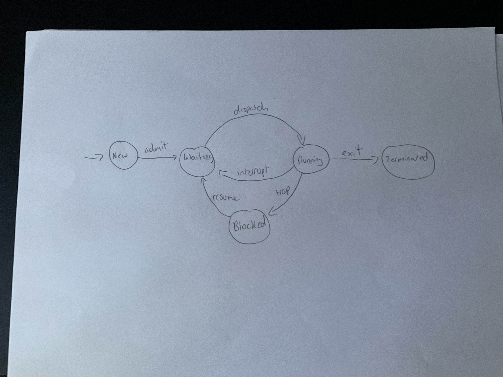

# Quiz #1: Models of Communication and Computation
### Date: Sep 29, 2023
### Timed Quiz: 1 hour
### Exam Time-frame
* Start: Friday: 17:00 (5:00pm)
* End: Sunday: 23:59 (11:59pm)

---
## Name:  answer key                                      <!-- response -->
## GitHub Account:                                        <!-- response -->


1. We can use a Finite State Machine (FSM) to model the interaction between the OS and your program.

On a piece of paper, 
   - draw the Process Status Diagram (PSD)
   - label both it states and edges
   - upload a picture of your FSM
   - submit this picture with the name of PSD.png<br>
  


1. An ISA is an abstraction for a physical computer.  This abstraction includes five (5) characteristics.  Enumerate these 5 major characteristics.
   1. The available instructions and their semantics.     <!-- response -->
   1. The supported data types.                           <!-- response -->
   1. The number, size, and width of registers, etc.      <!-- response -->
   1. The view of memory: orientation, segments, endianess, etc.                           <!-- response -->
   1. The OS interface.                                   <!-- response -->

1. Briefly describe the difference between a Sequential circuit and a Combinational Circuit.
   ```response
   A sequential circut has a feedback loop that
   allows it to remember a bit of information.
   The circuit is also controlled by a clock to enforce
   a step-by-step evaluation process.
   Whereas a combinational circuit computes a value
   independent of time based upon only current input values.
   ```

   <!-- You may add additional lines within the code block above, without the need to add additional response tag. -->


1. Define the following terms:
   1. interrupt
      - an asynchronous event that causes the kernel to excute   <!-- response -->
   1. trap
      - a synchronous event to request the kernel to perform an operation on behalf of the running program                           <!-- response -->
   1. lval
      - the address of a variable                              <!-- response -->
   1. rval
      - the value stored within a variable                     <!-- response -->


1. A 'Universal Computer' is an abstract machine based upon the Turing Machine.  This computer has a standardized control program to manage the underlying finite state machine. (This control program is akin to the computer firmware).  Two other programs are placed on the tape.  What are these two other programs:
  1. A specialized program, i.e., the OS, that manages the Turing Machine  <!-- response -->
  1. A generic program, i.e., the users program, that is executed by the Turning Machine        <!-- response -->


1. A Pushdown Automata (PDA) has more computational power than a Finite State Machine (FSM). What is the difference between the PDA and and FSM that provides the PDA with this additional power?
   1. The PDA has an infinite stack.                      <!-- response -->
   1. The infinite stack allows for a infinite number of configurations to be remembered.                                            <!-- response -->


1. Memory can be modeled as an array of bytes.  A register on the MIPS architecture contains 32 bits.  What role does endiance play when we execute an instruction to load a register with values stored within memory.
   ```response
   It determines the order, e.g., left-to-right or right-to-left, in which the four bytes from memory are placed within the register.
   ```
1. Given the following configuration of memory, answer the following questions:
   1. What is the value stored in memory at location `0x0100 0002`: 
      - 54                                                <!-- response -->
   1. What is the label associated with location `0x0100 0009` in memory
      - D                                                 <!-- response -->
   1. What is the lval associated with `B`:  
      -  0x0100 0003                                      <!-- response -->
   1. What is the rval associated with `B`:
      - 202                                               <!-- response -->
   1. What is the rval associated with `C[3]`:
      - 0                                                 <!-- response -->
   1. What is the lval associated with `C[3]`:
      - 0x0100 0008                                       <!-- response -->

|     | mem |              |
|-----|-----|--------------|
|     | 253 |  0x0100 000A |
| D:  |  42 |  0x0100 0009 |
|     |   0 |  0x0100 0008 |
|     |   1 |  0x0100 0007 |
|     |   2 |  0x0100 0006 |
| C:  |   3 |  0x0100 0005 |
|     |  77 |  0x0100 0004 |
| B:  | 202 |  0x0100 0003 |
|     |  54 |  0x0100 0002 |
| A:  | 123 |  0x0100 0001 |


