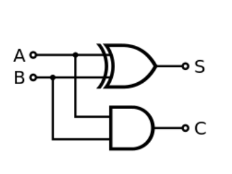
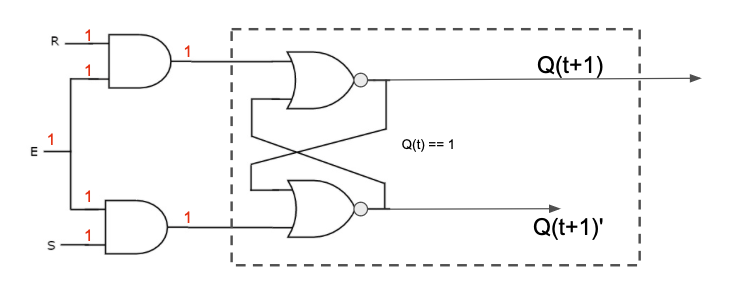
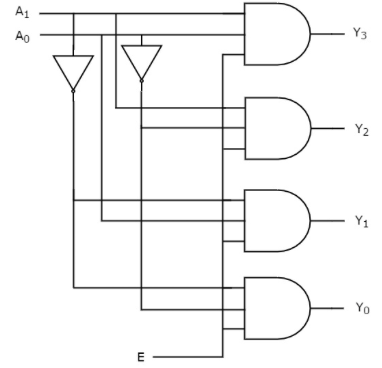

# Digitial Logic 
> A practice exercise to prepare for the the Digital Logic Section's quiz


## Name: Daniel Rutilo                              <!-- response -->
## GitHub Account: danielrutiloCSUN                 <!-- response -->

### Boolean Algebra
1. Given the following circuit, provide the equivalent Boolean expression:
   * (A + B) * (A' + B'), C = A * B                 <!-- response -->
   

 
1. Given the following truth table, provide the equivalent Boolean expression:
   * A'B'C + A'BC' + AB'C' + AB'C + ABC'              <!-- response -->

   | A  | B  | C | Output |
   |----|----|---|------- |
   | 0  | 0  | 0 | 0      |
   | 0  | 0  | 1 | 1      |
   | 0  | 1  | 0 | 1      |
   | 0  | 1  | 1 | 0      |
   | 1  | 0  | 0 | 1      |
   | 1  | 0  | 1 | 1      |
   | 1  | 1  | 0 | 1      |
   | 1  | 1  | 1 | 0      |

1. Convert the following truth table into a Karnaugh map.<br>
   (Make sure you update all of the x-s in the answer template.)
   
   | A  | B  | C | Output |
   |----|----|---|--------|
   | 0  | 0  | 0 |   0    |
   | 0  | 0  | 1 |   1    |
   | 0  | 1  | 0 |   1    |
   | 0  | 1  | 1 |   0    |
   | 1  | 0  | 0 |   1    |
   | 1  | 0  | 1 |   1    |
   | 1  | 1  | 0 |   1    |
   | 1  | 1  | 1 |   1    |

   <!-- Updated the table below to provide your answer -->
   |   |   | BC | BC | BC | BC | 
   |   |   | 00 | 01 | 11 | 10 | 
   |---|---| -- | -- | -- | -- | 
   | A | 0 | 0  | 1  | 0  | 1  | 
   | A | 1 | 1  | 1  | 1  | 1  | 


1. Simplify the following Boolean expressions:<br>
   1. ``A * ( B + C) + A' * ( B + C) ``
      * B + C                     <!-- response -->
   1. ``AB' + A'B + AB``
      *  A + A'B                  <!-- response -->
   1. ``(AB' + A'B + AB)'``
      * B                          <!-- response -->


1. You are provided with a truth table. By what method can you use to determine the equivalent Boolean algebra expression. (Your answer needs to be provided by a simple sentence.)
   ```
   By using sum of products on all combinations that results in 1 and then doing algebraic properties to find the equivalent boolean expression.                                                 <!-- response -->
   ```

   <!-- For the next two questions, you need not include the response tags -->
1. Update the following Karnaugh map by replacing the x's to provide the missing labeling information.

   |   |   | BC <br> 00 | BC <br> 01 | BC <br> 11 | BC <br> 10 |   
   |---|---| -----------|------------|------------|------------|   
   | A | 0 |         1  |         0  |         0  |         1  |   
   | A | 1 |         1  |         0  |         1  |         1  |   


1. For the Karnaugh map in the previous question, provide the equivalent truth table.
   
   | A | B | C | Output |
   |---|---|---|--------|
   | 0 | 0 | 0 |   1    |
   | 0 | 0 | 1 |   0    |
   | 0 | 1 | 0 |   1    |
   | 0 | 1 | 1 |   0    |
   | 1 | 0 | 0 |   1    |
   | 1 | 0 | 1 |   0    |
   | 1 | 1 | 0 |   1    |
   | 1 | 1 | 1 |   1    |

1. Using the above Karnaugh map, provide the equivalent Boolean expressions.
   * B'C' + BC' + AB                             <!-- response -->

1. Using the above truth table, provide the equivalent Boolean expression. Do NOT take steps to simplify the resulting Boolean expression.
   * A'B'C' + A'BC' + AB'C' + ABC' + ABC          <!-- response -->


1. Provide an example for each of the following Boolean algebra properties.

   *  associative property:  
      - `(A + B) + C = A + (B + C)`               <!-- response: example: is this correct? -->
   *  idempotent:
      - A + A = A                                 <!-- response -->
   *  absorption property:  
      - A + AB = A                                <!-- response -->
   *  commutative property:  
      - A + B == B + A                            <!-- response -->
   *  distributive property:  
      - A(B + C) = AB + AC                        <!-- response -->
   *  identity property:
      - 0 + A = A                                 <!-- response -->
   *  definition of XOR:
      - Exclusive OR. It's only true when values have different truth values.                           <!-- response -->
   *  annulment:
      -                                           <!-- response -->
   *  complement:
      - A + A' = 1                                <!-- response -->


1. Show the steps to show that `C'(B'C + ABC') + A(BC' + 1)` is equivalent to `A`.
   *  C'(B'C + ABC') + A(BC' + 1)  : given        <!-- response -->
   *  C'B'C + C'ABC' + A(1)                      <!-- response -->
   *  ABC' + A                                    <!-- response -->
   *  A                                           <!-- response --> 
   <!-- Add or Delete response lines above as necessary -->


### Circuits

1. You are given a SR latch that is storing the value of 1. You then provide the following values for inputs:  E=1, S=1, and R=1.  What is the final value for Q(t+1) and for Q(t+1)' ?
   * Q(t+1) : 0                                  <!-- response -->
   * Q(t+1)': 0                                  <!-- response -->




1. You are asked to build a register bank. Identify which of the following digital components you need. (To answer this question, simply remove the digital components your don't need.)
   * Decoder                                      <!-- response -->


       
1. Can all programs be computed via a combinational circuit, yes or no?
   *                                              <!-- response -->
   * Explain your answer:<br>
    <!-- Add additional lines, including the appropriate response tags, in the block below. -->
     ```
    No because it does not have memory.                         <!-- response -->
    ```
1. What is the difference between a control line and a data line?
   * A control line controls something such as an enabler. A data line transfers data in 0 or 1.      <!-- response -->

1. You have been asked to produce a combinational circuit that can select exactly 1 output from 16 different possible inputs.
   1. What basic combinational ciruit should be used?
      *                                   <!-- response -->
   1. How many selector lines will this circuit have?
      *                                   <!-- response -->

1. You have a CPU that has 120 registers. (Yes, 120 registers!)
   1. How many selector lines are included in this circuit
      *                                  <!-- response -->

1. Consider the following circuit

   

   1. What is the type of this circuit?
      *                                  <!-- response -->

1. You are provided with a 5-32 Decoder.
   1. What is the role of the "E"nable line?
      *                                  <!-- response -->

   3. What is the total number of inputs to this circuit?
      *                                  <!-- response -->

   5. What is the total number of outputs from this circuit?
      *                                  <!-- response -->


1. Explain the primary difference between a combinational and a sequential circuit.
   *                                     <!-- response -->
2. What is the primary difference between a SR-latch and a D-latch?
   *                                     <!-- response -->

### Microarchitecture

1. A CPU is an example of a sequential circuit, where different parts of the circuit is executed in well defined steps.  Answer the following questions related to such a sequential circuit.
   1. For the MIPS microarchitcture, enumerate and describe briefly what each of these steps does:
      1. Fetch: PC is incremented by 4, and the next instruction is read from main memory.                            <!-- response -->
      1.                                 <!-- response -->
      <!-- Feel free to add or remove additional response lines as needed. -->
 
   1. What type of digital component is used between each of these steps?
      *                                  <!-- response -->
 
   1. Why is the value of the PC incremented by 4 in each "fetch" stage?  
      *                                  <!-- response -->


1. What are the five (5) elements that are defined by an ISA?<br>
   1. Instructions                                    <!-- response -->
   1. Data Types                                      <!-- response -->
   1. Registers                                       <!-- response -->   
   1. Memory                                          <!-- response -->
   1. OS interface                                    <!-- response -->

   <!-- Add additional response lines as needed -->


1. In the MIPS micro-architecture, the PC is incremented for each instruction, during the "Instruction Fetch" stage.  The value of the PC may also be updated later within the "Memory Access" phase.

   * If the value of the PC is: 0x0000 2F1C, what is the value of the PC after you complete the execution of the instruction:  ``addi $t0, $s0, $ra``?
      *                                           <!-- response -->

1. The MIPS I-format includes a 16-bit field, which is used to encode an immediate value.  During the "Instruction Decode" phase this 16-bit value is transformed into a 32-bit value.  For each of the following values, provide 16-bit value that is stored in the instruction and the 32-bit value that is passed to the ALU.
   * 0x7FF7:  
     * 16-bit value: 0111 1111 1111 0111          <!-- response -->
     addi
     * 32-bit value: 0000 1000 0000 0000 0111 1111 1111 0111       <!-- response -->
   * 0xAAAA:  
     * 16-bit value:                              <!-- response -->
     * 32-bit value:                              <!-- response -->
   * -2:                
     * 16-bit value:                              <!-- response -->
     * 32-bit value:                              <!-- response -->
   * 7:                   
     * 16-bit value:                              <!-- response -->
     * 32-bit value:                              <!-- response -->


